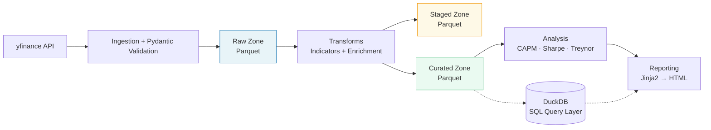

# finance-data-platform

A layered data platform for financial market data — from ingestion to automated reporting — built with modern Python data engineering practices.


[](pyproject.toml)
[](LICENSE)

## Architecture



> Entire flow orchestrated by an Apache Airflow DAG. Each zone is a separate Parquet directory queryable via DuckDB.

## Tech Stack

| Layer | Tool | Why |
|---|---|---|
| Language | Python ≥ 3.11 | Industry standard for DE and finance |
| Ingestion | yfinance | Free, reliable OHLCV source |
| Validation | Pydantic v2 | Schema enforcement at ingestion boundary |
| Storage | Parquet (pyarrow) | Columnar, compressed, cloud-compatible |
| Query | DuckDB | Embedded analytical SQL on Parquet — no server needed |
| Transforms | pandas + numpy | Portable, testable, no framework lock-in |
| Analysis | statsmodels + scipy | CAPM regression, statistical tests |
| Reporting | Jinja2 + matplotlib | Templated HTML with embedded base64 charts |
| Orchestration | Apache Airflow 2.x | Most recognized DE orchestrator in finance/banking |
| Container | Docker + docker-compose | Full reproducibility, one-command setup |
| Testing | pytest | Standard Python testing |
| Linting | ruff | Replaces flake8 + isort + black in one tool |
| CI | GitHub Actions | Lint + test on every push/PR |

## Quickstart

### With Docker (recommended)

```bash
docker-compose up
```

This starts the full stack (app + Airflow webserver, scheduler, worker). The Airflow DAG triggers the complete pipeline automatically.

### Without Docker

```bash
# Clone and install
git clone https://github.com/shervin-taheripour/finance-data-platform.git
cd finance-data-platform
pip install -e ".[dev]"

# Run the full pipeline
make pipeline
```

The pipeline ingests market data, runs transforms and analysis, and produces an HTML report in `output/`.

## Data Zones

| Zone | Path | Contents |
|---|---|---|
| **Raw** | `data/raw/` | Unmodified API responses — Parquet with ingestion timestamp |
| **Staged** | `data/staged/` | Cleaned + indicator-enriched (SMA, EMA, RSI, MACD, Bollinger) |
| **Curated** | `data/curated/` | Analysis-ready datasets (returns, correlations, portfolio metrics) |

## Sample Output

> See [`examples/sample_report.html`](examples/sample_report.html) for a pre-generated report.

<!-- TODO: Add screenshot of generated report -->

## Project Structure

```
finance-data-platform/
├── src/finance_data_platform/
│   ├── ingestion/          # yfinance connector + Pydantic schemas
│   ├── storage/            # Parquet store with DuckDB read interface
│   ├── transforms/         # Technical indicators + enrichment
│   ├── analysis/           # CAPM, Sharpe, Treynor, portfolio variance
│   └── reporting/          # Jinja2 HTML report generator + templates
├── orchestration/
│   └── dags/               # Airflow DAG definition
├── tests/                  # Unit + integration tests (fixture data, no live API)
├── data/                   # Raw / staged / curated zones (.gitignored)
├── output/                 # Generated reports (.gitignored)
├── examples/               # Sample report (committed)
├── docs/                   # DESIGN.md, architecture.md
├── config.yaml             # Single runtime config file
├── Makefile                # CLI shortcuts for all pipeline steps
├── Dockerfile
├── docker-compose.yml
└── pyproject.toml
```

## Configuration

All runtime parameters are controlled by a single `config.yaml`:

```yaml
universe:
  tickers: ["AAPL", "MSFT", "GOOGL", "JPM", "GS", "BAC"]
  benchmark: "SPY"
  start_date: "2020-01-01"
  end_date: null  # null = today
```

See [`config.yaml`](config.yaml) for the full reference (ingestion retries, indicator windows, risk-free rate, output paths).

## Makefile Targets

```
make ingest       # Run ingestion for configured universe
make transform    # Run indicator + enrichment transforms
make analyze      # Run CAPM and portfolio analysis
make report       # Generate HTML report from curated data
make pipeline     # Run full pipeline: ingest → transform → analyze → report
make test         # Run pytest
make lint         # Run ruff linter
make clean        # Remove data/ and output/ contents
make docker-up    # Start full stack via docker-compose
make docker-down  # Stop all containers
```

## Testing

```bash
make test
```

Tests use fixture data (saved Parquet snapshots) and never hit the live yfinance API. Coverage includes schema validation, indicator calculations, portfolio analysis, and an end-to-end integration test.

## Design Decisions

See [`docs/DESIGN.md`](docs/DESIGN.md) for architecture rationale and trade-offs for every major technical choice, including what was chosen, what was rejected, and why.

## Origin

Evolved from a certification capstone project ([stock-analysis-tool](https://github.com/shervin-taheripour/stock-analysis-tool), built with Dariya Sharonova, 2025). This repo re-engineers the domain logic into a production-grade platform with orchestration, testing, and reproducibility.

## License

[MIT](LICENSE)
