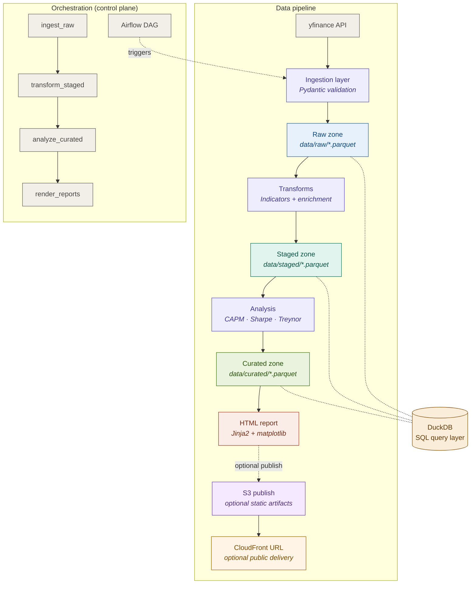

# finance-data-platform

[](https://github.com/shervin-taheripour/finance-data-platform/actions/workflows/ci.yml)
[](pyproject.toml)
[](LICENSE)

A layered data platform for financial market data, from ingestion to automated HTML reporting. The implementation emphasizes explicit data contracts, partitioned Parquet storage, DuckDB analytical reads, Airflow orchestration, Docker reproducibility, and self-contained report artifacts.

## Why This Project Exists

This repo is a production-minded rebuild of an earlier finance analytics project. The original was notebook-heavy and exploratory. This version re-engineers the same domain into a layered data platform with explicit contracts, partitioned storage, orchestration, and reproducibility.

## What The Pipeline Does

1. Downloads OHLCV, dividends, splits, and metadata from yfinance
2. Validates records with Pydantic at the ingestion boundary
3. Writes ticker-partitioned Parquet files into the raw zone
4. Builds technical indicators and enriched return series
5. Computes CAPM and portfolio risk metrics
6. Renders self-contained HTML reports with embedded charts
7. Optionally publishes generated reports to AWS S3 behind CloudFront
8. Runs either locally through `make` targets or under Airflow via Docker Compose

## Architecture



Two execution modes: `make pipeline` for local development, or `docker-compose up` for the full Airflow-orchestrated path. Both run the same Python entrypoints.

Full architecture blueprint: [docs/architecture.md](docs/architecture.md) · Design rationale: [docs/DESIGN.md](docs/DESIGN.md)

## Tech Stack

| Area | Choice | Why this was chosen |
|---|---|---|
| Language | Python 3.11+ | Strong ecosystem support for data engineering and finance |
| Source data | yfinance | Fastest single-source path to OHLCV, dividends, splits, and metadata |
| Validation | Pydantic v2 | Explicit ingestion boundary and strong schema contracts |
| File format | Parquet / pyarrow | Columnar, compressed, analytics-friendly, cloud-ready |
| Query layer | DuckDB | SQL directly on Parquet without standing up a project database |
| Transforms | pandas + numpy | Readable and portable for MVP-scale analytical data |
| Analysis | pandas-based finance math | Sufficient for CAPM and portfolio metrics without overcomplicating the stack |
| Reporting | Jinja2 + matplotlib | Self-contained HTML artifact instead of a running dashboard |
| Cloud publish | AWS S3 + CloudFront | Optional public delivery layer for generated report artifacts |
| Orchestration | Apache Airflow | Clear task dependency management, retries, scheduling, and run history |
| Containerization | Docker Compose | Reproducible local orchestration stack |
| Testing | pytest | Standard Python testing workflow |
| Linting | Ruff | Fast, simple, modern linting |
| CI | GitHub Actions | Visible and lightweight automation on every push |

## Storage Model

| Zone | Path | Purpose |
|---|---|---|
| Raw | `data/raw/` | Validated source records, preserved close to ingestion output |
| Staged | `data/staged/` | Indicator-enriched price series |
| Curated | `data/curated/` | Analysis-ready returns, correlations, and summary metrics |
| Output | `output/` | Generated HTML reports |
| Examples | `examples/` | Committed sample output for inspection without running the pipeline |

Ticker-level partitioning is used intentionally. Re-running `AAPL` should not mutate `MSFT`, and debugging should be as simple as opening one parquet file for one ticker.

## Sample Output

Pre-generated sample report:
[Example report](https://shervin-taheripour.github.io/finance-data-platform/examples/sample_report.html)

Current report artifacts are also generated into `output/` when the pipeline runs.

## Live Reports

Cloud publishing is optional. When configured, `make publish` uploads the contents of `output/` plus the shared report stylesheet to a private S3 bucket behind CloudFront.

Example URL shape after deployment:
- `https://d9m4ljhm4l3qi.cloudfront.net/reports/aapl_report.html`

Setup notes and least-privilege AWS templates live under [infra/aws/README.md](infra/aws/README.md).

## MVP Report Surface

Report labels and value formats are defined in [config/report_fields.yaml](config/report_fields.yaml). This file is the source of truth for report-facing field names and formatting.

Current MVP report fields:

- Company profile
  - `symbol`
  - `short_name`
  - `long_name`
  - `sector`
  - `industry`
  - `country`
  - `currency`
  - `exchange`
  - `market_cap`
  - `shares_outstanding`
  - `as_of_date`
  - `source`
- Latest indicators
  - `sma_*`
  - `ema_*`
  - `rsi_*`
  - `macd_line`
  - `volatility_*`
- Risk metrics
  - `sharpe_ratio`
  - `treynor_ratio`
  - `beta`
  - `alpha`
  - `equal_weight_variance`
- Cumulative returns
  - `symbol`
  - `cumulative_return`

## Quickstart

### Docker + Airflow

Prerequisites:
- Docker
- Docker Compose v2

Run the orchestration stack:

```bash
make docker-up
```

Then open:
- `http://localhost:8080`
- username: `admin`
- password: `admin`

Inside Airflow, trigger the DAG:
- `finance_data_platform_pipeline`

Stop the stack:

```bash
make docker-down
```

### Non-Docker Local Path

```bash
git clone git@github.com:shervin-taheripour/finance-data-platform.git
cd finance-data-platform
python3 -m venv .venv
source .venv/bin/activate
python -m pip install -e ".[dev]"
```

Optional publishing dependency:

```bash
python -m pip install -e ".[publishing]"
```

Run ingestion once to populate the raw zone:

```bash
make ingest
```

Run steps individually:

```bash
make transform
make analyze
make report
```

Or run the raw-to-report flow after ingestion:

```bash
make pipeline
```

Optional publish step after reports are generated:

```bash
make publish
make publish-dry-run
```

## Configuration Reference

All runtime configuration lives in [config.yaml](config.yaml).

Key sections:
- `universe`: tickers, benchmark, date window
- `ingestion`: retry attempts and delay
- `storage`: base path and file format
- `transforms.indicators`: SMA, EMA, RSI, MACD, Bollinger, volatility windows
- `transforms.enrichment`: rolling correlation window
- `analysis`: risk-free rate
- `reporting`: output path, template path, and field registry
- `publishing`: S3 bucket, region, prefix, and CloudFront distribution settings

Example:

```yaml
universe:
  tickers: ["AAPL", "MSFT", "GOOGL", "JPM", "GS", "BAC"]
  benchmark: "SPY"
  start_date: "2020-01-01"
  end_date: null
```

## Project Structure

```text
finance-data-platform/
├── src/finance_data_platform/
│   ├── ingestion/
│   ├── storage/
│   ├── transforms/
│   ├── analysis/
│   ├── reporting/
│   └── publishing/
├── orchestration/dags/
├── tests/
├── data/
│   ├── raw/
│   ├── staged/
│   └── curated/
├── output/
├── examples/
├── docs/
├── infra/aws/
├── assets/
├── config.yaml
├── Makefile
├── Dockerfile
├── docker-compose.yml
└── pyproject.toml
```

## Make Targets

```bash
make ingest       # Download and persist raw market data
make transform    # Build staged indicator datasets
make analyze      # Build curated analytical outputs
make report       # Render HTML reports
make publish      # Upload reports to S3 and invalidate CloudFront
make publish-dry-run  # Preview uploads/invalidation without changing AWS state
make pipeline     # Run transform -> analyze -> report
make test         # Run pytest
make lint         # Run Ruff
make docker-up    # Start PostgreSQL + Airflow stack
make docker-down  # Stop orchestration stack
```

## Testing And CI

The test suite is fully offline. It uses fixture data and integration checks rather than live API calls.

Coverage includes:
- schema validation
- ingestion/storage behavior
- technical indicators and enrichment
- portfolio analysis
- report generation
- orchestration asset smoke checks

CI runs lint + test on every push via GitHub Actions.

## Design Highlights

A few choices worth calling out directly:
- DuckDB is the project data query layer
- PostgreSQL is used only for Airflow metadata
- Airflow orchestrates existing Python entrypoints instead of owning business logic
- reports are generated as static artifacts, not dashboards
- the storage layout is cloud-friendly without pretending cloud deployment is part of the MVP

## Origin

Evolved from a certification capstone project ([stock-analysis-tool](https://github.com/shervin-taheripour/stock-analysis-tool), built with Dariya Sharonova, 2025). The original was notebook-heavy and exploratory. This repo re-engineers the domain logic into a modular platform with layered storage, orchestration, testing, and reproducibility.

## Release Notes

MVP release notes:
- [CHANGELOG.md](CHANGELOG.md)

## License

[MIT](LICENSE)
